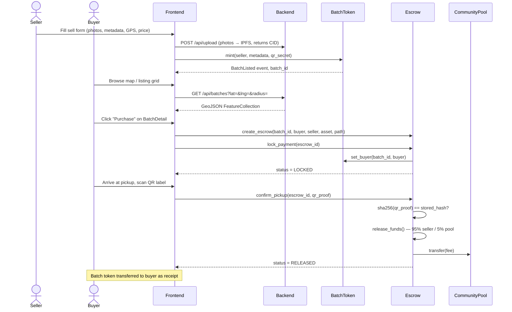

# BuildCycle — Architecture

## Directory Tree

```
buildcycle/
├── contracts/          # Soroban smart contracts (Rust)
│   ├── batch-token/    # NFT: mint, metadata, QR, geo
│   ├── escrow/         # Payment lock, 95/5 split, disputes
│   └── community-pool/ # Fee aggregation, proposals, voting
├── frontend/           # Next.js 14 + TypeScript + Tailwind
│   └── src/
│       ├── components/ # Reusable UI (WalletConnector, MapPicker, QR…)
│       ├── pages/      # Routes: /, /browse, /batches/[id], /sell…
│       ├── hooks/      # useEscrow, React Query wrappers
│       ├── stores/     # Zustand: useWalletStore
│       └── utils/      # stellar.ts, mockContract.ts, mockData.ts
├── backend/
│   ├── src/            # Express API (TypeScript)
│   └── indexer/        # Horizon event indexer (Rust + sqlx)
├── scripts/            # deploy-contracts.sh, setup-testnet.sh, e2e-test.sh
└── docs/               # This file
```

---

## Purchase Flow — Sequence Diagram



---

## Data Flow Diagram

```
Browser (Freighter wallet)
    │
    │  XDR transactions
    ▼
Stellar Network (Soroban)
    │  BatchListed / EscrowReleased / BatchClaimed events
    ▼
backend/indexer (Rust + Horizon stream)
    │  INSERT / UPDATE
    ▼
PostgreSQL + PostGIS
    │  SQL queries (ST_DWithin for geo)
    ▼
backend/src (Express REST API)
    │  JSON / GeoJSON
    ▼
Frontend (React Query cache, 30s stale time)
    │
    ▼
User sees live map, listing grid, escrow status
```

---

## Key Design Decisions

**Why Stellar path payments instead of a swap contract?**  
Stellar's native `path_payment_strict_send` finds the cheapest route through the built-in DEX automatically. No custom AMM contract, no liquidity management, no extra gas.

**Why QR hash-on-chain?**  
Only `sha256(secret)` is stored — the plaintext never hits the chain. The QR label on the pallet is the single source of truth for physical pickup. Tampering with the label breaks the hash.

**Why 5% non-negotiable community fee?**  
It's enforced in the Escrow contract's `release_funds()`. No platform intermediary can waive it. This makes BuildCycle a public utility rather than a rent-seeking marketplace.

**React Query stale times**  
- Batch listings / map markers: 60s stale, 5m cache — data changes infrequently.  
- Escrow status: 5–10s refetch interval — buyers need near-real-time updates post-payment.

---

## Bundle Optimization Opportunities

Run `npm run analyze` in `frontend/` to generate a visual bundle report. Known large dependencies to watch:

| Package | Approx size | Mitigation |
|---|---|---|
| `leaflet` + `react-leaflet` | ~150 kB | Dynamic import (`next/dynamic`, `ssr: false`) — already applied |
| `qrcode.react` | ~50 kB | Load only on `/sell` and `/scan` routes |
| `@stellar/freighter-api` | ~80 kB | Load only after wallet connect attempt |
| `@tanstack/react-query` | ~35 kB | Acceptable; shared across all pages |
